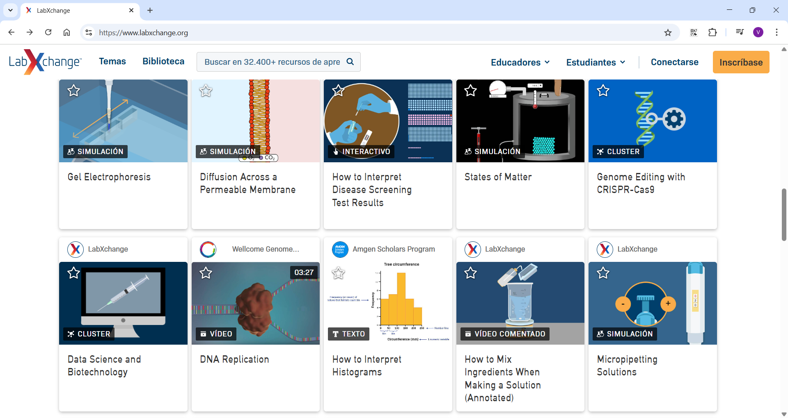
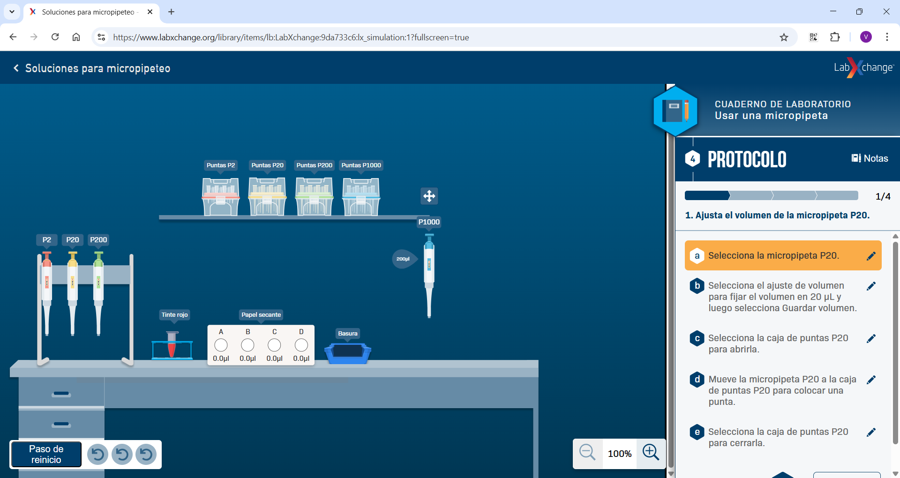
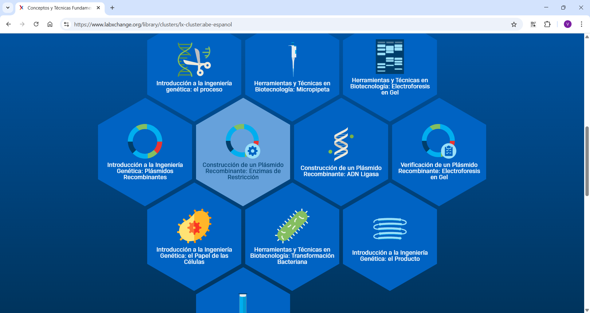

# PEC3: Visionando el futuro con las gafas de Manovich 

#### Autor: Virginia Martín Donoso

#### Fecha: 16/05/2025 

## Introducción

Para realizar un análisis sobre si una aplicación es una hibridación de medios o un caso de multimedia, tenemos que diferenciar qué es cada una: En documentos y aplicaciones interactivas multimedia, los contenidos de cada medio aparecen uno junto otro […] Cada elemento de un mensaje multimedia se abre en su propio visor. Por contra, en los híbridos de medios, las interfaces, técnicas y en última instancia las presuposiciones más básicas de los diversos formatos y tradiciones de medios se unen y dan pie a nuevas *gestalts de medios*. Es decir, se fusionan para ofrecer una experiencia nueva y coherente, que es distinto a experimentar los elementos uno por uno. (Manovich, 2013, p141).

Partiendo de esta base, se analizarán dos ejemplos con diferentes utilidades: **Shazam** y **LabXChange**.    

Es una aplicación basada en reconocimiento automático para averiguar canciones en unos segundos. También se pueden consultar conciertos y listas musicales basadas en el mismo tipo de música detectado. Además se puede enlazar con Apple Music o Spotify.

Es una hibridación de medios donde se conectan diferentes tecnologías para poder llegar al resultado final, averiguar qué canción es la que estamos escuchando, en tan solo unos segundos.

  

En este caso concreto se podría considerar en que es una evolución de medios y también se podría enfocar con una perspectiva de remezcla de medios. La primera porque nos ayuda desde un punto de vista tecnológico a identificar una canción que antes no podíamos hacer, de forma que utiliza el teléfono móvil como medio, buscando la huella digital que se crea, pasando por los algoritmos y las bases de datos donde se registra el material. Y en la segunda porque se combinan varios recursos para poder identificar la canción como son la creación del registro donde se almacenarán todas las canciones, pasando por la captación de la canción y terminando con la utilización de diferentes algoritmos para su identificación.

|  |  
|:--:|:--:|
| *Figura 1: Elementos del sonido* | *Figura 2: Huella digital* |

Se obtiene una interfaz donde el usuario interactúa con elementos de diseño gráfico, bases de datos y el algoritmo de reconocimiento.

Se crea un nuevo lenguaje basado en todas las técnicas anteriores, que además se puede compartir con otras aplicaciones que siguen siendo interactivas como por ejemplo Spotify. Antes, la identificación de una canción se hacía directamente desde el conocimiento de la persona, ahora, la tecnología lo sustituye, realizándose de forma automática y prácticamente instantánea.

Aunque se conecta con otras aplicaciones, no se puede considerar una plataforma de medios, ya que sirve para identificar canciones pero no permite interactuar con otros usuarios ni tampoco intercambiar información entre ellos desde la plataforma. En este caso habría que utilizar las aplicaciones con las que se enlaza para poder escuchar una canción entera, ver el vídeo o crear listas personalizadas y compartir el contenido.

En las estrategias de hibridación se pueden observar, primero la creación de la huella digital de audio, pasando la música analógica a la digitalización y colocándolas en una base de datos donde se almacenan. Para el reconocimiento de la canción, hay que pasar la canción de forma analógica a digital, al captarla con el dispositivo. El paso siguiente es reconocer esa canción utilizando el algoritmo que identifica la canción en Shazam, enviando la respuesta al dispositivo.

La estética de la hibridación es prácticamente invisible, ya que el usuario no identifica en ningún momento ni puede ver, la parte más técnica de la aplicación, de manera que la interacción es muy sencilla.

Entre las técnicas independientes del medio están:

- Las utilizadas para poder crear la base de datos con todas las huellas de audio, para ello se tienen que recoger datos sobre frecuencia, tiempo y amplitud que son los parámetros que tiene el sonido. De esta forma cada canción tendrá sus propios datos y con ello se realizará el reconocimiento.
- Las técnicas utilizadas es la que identifica la canción basándose en el patrón que tiene cada canción, usando los datos anteriormente descritos para crear la huella.
- Hay técnicas para mostrar el resultado con la información de la carátula del disco y el artista y las que se utilizan para sugerir la música del estilo a la encontrada.

Es una aplicación fácil de utilizar, con un interfaz muy sencilla y que se enfoca directarmente al fin para el que ha sido creada.

  

  

<a href="https://www.labxchange.org/">
 <https://www.labxchange.org/>
</a>

Es una plataforma online gratuita que ofrece a profesores y alumnos contenido digital, en forma de recursos interactivos y simuladores para realizar un aprendizaje activo en ciencias. Experimente lo que debería ser la ciencia: exploración a través del pensamiento audaz, la colaboración y una imaginación sin límites (LabXChange).
En este caso se trata de un recurso multimedia donde se combinan imágenes, vídeos, sonido, simulaciones interactivas y todo lo relacionado con la creación de la experiencia interactiva. 

                   [Cómo funciona.](https://www.youtube.com/watch?v=G8TF0fnSo_M&t=4s)

Es una remezcla de medios donde se utilizan materiales multimedia de otras plataformas y se combinan y organizan para que el usuario pueda identificarlo y utilizarlo de manera eficiente. Se crea una experiencia interactiva pero con recursos ya existentes.

Aunque se fomenta el aprendizaje activo a través de los recursos interactivos, y se pueden diseñar y personalizar, no se crea un nuevo lenguaje al tratarse de una plataforma con contenido basado en textos, vídeos explicativos, etc existente en el ámbito educativo. 

Se considera una plataforma de medios porque aloja contenido y permite formar parte de una comunidad, además de personalizar las preferencias para poder obtener contenido según las necesidades.

En la web se presentan tres opciones principales que son:

- Explorar: Descubir contentido
- Crear: Personalización
- Compartir: Comunidad de profesores y alumnos.

Además contiene una biblioteca con todos los recursos y personas que forman parte de la comunidad y las fuentes desde las que se obtiene el material.

Entre el contenido se pueden diferenciar distintos tipos de recursos:
- Vídeos
- Simuladores interactivos
- Guías didácticas
- Material interactivo
- Grupos con diferentes combinaciones de los anteriores
  
   

La estética de la hibridación se muestra ordenada, intuitiva y sencilla. El usuario distingue cada tipo de material y la combinación de las distintas técnicas para la elaboración de cada recurso se complementa perfectamente hasta obtener el material final con el que el usuario realizará su experiencia.

Se pueden considerar técnicas independientes las utilizadas para mostrar el contenido personalizado según las preferencias del usuario. También lo serían las técnicas que hacen que se agrupen los diferentes recursos y convergen en un mismo recurso de aprendizaje.

Incluso si se da un enfoque relacionado con el entorno digital, en estos recursos se muestran técnicas que no tienen relación, ya que se usan en laboratorios y otros ámbitos científicos como por ejemplo el uso de pipetas.

Se combinan diferentes tipos de medios media e interactivos que en conjunto crean una herramienta adaptada para la enseñanza y el aprendizaje de distintos temas científicos.

## Conclusión

Lo que antes eran combinaciones sencillas poco interactivas a nivel de medios y contenido en las aplicaciones y *software*, se ha convertido en un conjunto de técnicas, en algunos casos compuestas de complicadas bases de datos y algoritmos, donde el usuario interacciona obteniendo una experiencia más completa y satisfactoria.

Con toda la evolución de la tecnología y la cultura digital, se puede confirmar que las técnicas de distintos medios que hasta entonces habían sido incompatibles empiezan a combinarse en infinitas y novedosas combinaciones, lo que da pie al nacimiento de nuevos medios híbridos (Manovich,  2013).

En la cultura digital la evolución de los medios continúa progresando a pasos de gigante con la que se pueden realizar infinidad de funciones, tanto a nivel personal, laboral, ocio, etc.

## Bibliografía y webgrafía

- Manovich, Lev. (2013). *El Software toma el mando*. Barcelona: Editorial UOC.
- *How does the Shazam app recognize music? An explanation of music recognition technology used in the Shazam app* [en línea] [consulta:mayo de 2025].Disponible en: https://www.techaheadcorp.com/blog/decoding-shazam-how-does-music-recognition-work-with-shazam-app/
- *Coding Geek* [en línea] [consulta:mayo de 2025]. Disponible en: https://web.archive.org/web/20180710041442/http://coding-geek.com/how-shazam-works/
- Martín Barbero, Iván, cómo utilizar Shazam con Spotify para tener tus listas actualizadas. En: *Cinco días* [en línea]. 15 de septiembre de 2022 [consulta:mayo de 2025]. Disponible en: https://cincodias.elpais.com/smartlife/2022/09/15/lifestyle/1663217670_538024.html
- Oleg, Luis, la huella digital de la música. En: *PROz* [en línea].3 de marzo de 2020 [consulta:mayo de 2025]. Disponible en: https://proleon.com.mx/estilo_de_vida/la-huella-digital-de-la-musica/
- Palomino, Kevin. Medios digitales: ¿Qué son y cuáles son los tipos? [en línea]. En: *Blog de la Universidad del Sur de New Hampshire*, [en línea] 6 de febrero de 2025 [consulta: mayo de 2025]. Disponible en: https://es.snhu.edu/blog/cuales-son-los-tipos-de-medios-digitales#:~:text=Son%20los%20espacios%20en%20los,se%20encuentran%20disponibles%20en%20internet
- LabXChange [en línea][consulta: mayo de 2025].Disponible en: https://www.labxchange.org/
- LabXchange, la plataforma de ciencias de Harvard, proporciona una herramienta gratuita para crear clases y caminos en línea. En: *iblnews.es* [en línea]. 5 de abril de 2020[consulta:mayo de 2025]. Disponible en:https://iblnews.es/la-plataforma-cientifica-labxchange-harvards-proporciona-una-herramienta-gratuita-para-crear-clases-y-caminos-en-linea/

 

----

Licencia: Material Creative Commons desarrollado bajo licencia CC BY-SA 4.0. Imágenes [Freepik](https://www.freepik.es/), [LabXChange](https://www.labxchange.org/)
